# AORTA Models UML Class Diagram

## PyBIRD AI - AORTA Lineage Tracking Models (UML Class View)

This UML class diagram shows the object-oriented structure and inheritance relationships of the AORTA models.

```mermaid
classDiagram
    %% Abstract Base Classes
    class AortaTable {
        <<abstract>>
    }
    
    class AortaColumn {
        <<abstract>>
    }
    
    class AortaRow {
        <<abstract>>
    }
    
    class AortaActualValue {
        <<abstract>>
    }
    
    class PopulatedTable {
        <<abstract>>
        +trail: Trail
    }
    
    %% Core Trail Classes
    class Trail {
        +id: int
        +name: string
        +created_at: datetime
        +execution_context: json
        +metadata_trail: MetaDataTrail
        +__str__() string
    }
    
    class MetaDataTrail {
        +id: int
        +__str__() string
    }
    
    %% Table Model Classes
    class DatabaseTable {
        +id: int
        +name: string
        +__str__() string
    }
    
    class DerivedTable {
        +id: int
        +name: string
        +table_creation_function: TableCreationFunction
        +__str__() string
    }
    
    %% Column Model Classes
    class DatabaseField {
        +id: int
        +name: string
        +table: DatabaseTable
        +__str__() string
    }
    
    class Function {
        +id: int
        +name: string
        +function_text: FunctionText
        +table: DerivedTable
        +__str__() string
    }
    
    %% Row Model Classes
    class DatabaseRow {
        +id: int
        +row_identifier: string
        +populated_table: PopulatedDataBaseTable
        +__str__() string
    }
    
    class DerivedTableRow {
        +id: int
        +row_identifier: string
        +populated_table: EvaluatedDerivedTable
        +__str__() string
    }
    
    %% Value Model Classes
    class DatabaseColumnValue {
        +id: int
        +value: float
        +string_value: string
        +column: DatabaseField
        +row: DatabaseRow
        +__str__() string
    }
    
    class EvaluatedFunction {
        +id: int
        +value: float
        +string_value: string
        +function: Function
        +row: DerivedTableRow
        +__str__() string
    }
    
    %% Populated Table Classes
    class PopulatedDataBaseTable {
        +id: int
        +table: DatabaseTable
        +__str__() string
    }
    
    class EvaluatedDerivedTable {
        +id: int
        +table: DerivedTable
        +__str__() string
    }
    
    %% Supporting Classes
    class FunctionText {
        +id: int
        +text: string
        +language: string
        +__str__() string
    }
    
    class TableCreationFunction {
        +id: int
        +name: string
        +function_text: FunctionText
        +__str__() string
    }
    
    class AortaTableReference {
        +id: int
        +metadata_trail: MetaDataTrail
        +table_content_type: string
        +table_id: int
    }
    
    %% Lineage Tracking Classes
    class FunctionColumnReference {
        +id: int
        +function: Function
        +content_type: ContentType
        +object_id: int
        +referenced_column: GenericForeignKey
        +__str__() string
    }
    
    class DerivedRowSourceReference {
        +id: int
        +derived_row: DerivedTableRow
        +content_type: ContentType
        +object_id: int
        +source_row: GenericForeignKey
        +__str__() string
    }
    
    class EvaluatedFunctionSourceValue {
        +id: int
        +evaluated_function: EvaluatedFunction
        +content_type: ContentType
        +object_id: int
        +source_value: GenericForeignKey
        +__str__() string
    }
    
    class TableCreationSourceTable {
        +id: int
        +table_creation_function: TableCreationFunction
        +content_type: ContentType
        +object_id: int
        +source_table: GenericForeignKey
        +__str__() string
    }
    
    class TableCreationFunctionColumn {
        +id: int
        +table_creation_function: TableCreationFunction
        +content_type: ContentType
        +object_id: int
        +column: GenericForeignKey
        +reference_text: string
        +__str__() string
    }
    
    %% Django Framework Classes
    class ContentType {
        +id: int
        +model: string
        +app_label: string
    }
    
    class GenericForeignKey {
        <<interface>>
    }
    
    %% Inheritance Relationships
    AortaTable <|-- DatabaseTable
    AortaTable <|-- DerivedTable
    
    AortaColumn <|-- DatabaseField
    AortaColumn <|-- Function
    
    AortaRow <|-- DatabaseRow
    AortaRow <|-- DerivedTableRow
    
    AortaActualValue <|-- DatabaseColumnValue
    AortaActualValue <|-- EvaluatedFunction
    
    PopulatedTable <|-- PopulatedDataBaseTable
    PopulatedTable <|-- EvaluatedDerivedTable
    
    %% Composition Relationships
    Trail *-- MetaDataTrail : contains
    Trail *-- PopulatedDataBaseTable : contains
    Trail *-- EvaluatedDerivedTable : contains
    
    DatabaseTable *-- DatabaseField : has
    DerivedTable *-- Function : has
    
    PopulatedDataBaseTable *-- DatabaseRow : contains
    EvaluatedDerivedTable *-- DerivedTableRow : contains
    
    DatabaseRow *-- DatabaseColumnValue : contains
    DerivedTableRow *-- EvaluatedFunction : contains
    
    %% Association Relationships
    PopulatedDataBaseTable --> DatabaseTable : instances of
    EvaluatedDerivedTable --> DerivedTable : instances of
    
    DatabaseField --> DatabaseTable : belongs to
    Function --> DerivedTable : belongs to
    Function --> FunctionText : implemented by
    
    DatabaseRow --> PopulatedDataBaseTable : belongs to
    DerivedTableRow --> EvaluatedDerivedTable : belongs to
    
    DatabaseColumnValue --> DatabaseField : typed by
    DatabaseColumnValue --> DatabaseRow : belongs to
    
    EvaluatedFunction --> Function : computed by
    EvaluatedFunction --> DerivedTableRow : belongs to
    
    DerivedTable --> TableCreationFunction : created by
    TableCreationFunction --> FunctionText : implemented by
    
    MetaDataTrail --> AortaTableReference : references
    
    %% Lineage Relationships
    Function --> FunctionColumnReference : references columns
    DerivedTableRow --> DerivedRowSourceReference : derived from
    EvaluatedFunction --> EvaluatedFunctionSourceValue : computed from
    TableCreationFunction --> TableCreationSourceTable : uses sources
    TableCreationFunction --> TableCreationFunctionColumn : references columns
    
    %% Generic FK Support
    FunctionColumnReference --> ContentType
    DerivedRowSourceReference --> ContentType
    EvaluatedFunctionSourceValue --> ContentType
    TableCreationSourceTable --> ContentType
    TableCreationFunctionColumn --> ContentType
    
    FunctionColumnReference ..> GenericForeignKey : uses
    DerivedRowSourceReference ..> GenericForeignKey : uses
    EvaluatedFunctionSourceValue ..> GenericForeignKey : uses
    TableCreationSourceTable ..> GenericForeignKey : uses
    TableCreationFunctionColumn ..> GenericForeignKey : uses
```

## Class Hierarchy Overview

### 🏗️ **Abstract Base Classes**
Define common interfaces for the AORTA architecture:

- **`AortaTable`** - Base for all table types
- **`AortaColumn`** - Base for all column types  
- **`AortaRow`** - Base for all row types
- **`AortaActualValue`** - Base for all value types
- **`PopulatedTable`** - Base for table instances with data

### 📊 **Concrete Model Classes**

#### **Core Trail Structure**
- **`Trail`** - Execution container with metadata
- **`MetaDataTrail`** - Schema definitions container

#### **Table Models** (inherit from AortaTable)
- **`DatabaseTable`** - Source data tables
- **`DerivedTable`** - Computed/calculated tables

#### **Column Models** (inherit from AortaColumn)
- **`DatabaseField`** - Physical columns in source tables
- **`Function`** - Computed columns with dependencies

#### **Row Models** (inherit from AortaRow)
- **`DatabaseRow`** - Rows with actual data
- **`DerivedTableRow`** - Rows with computed results

#### **Value Models** (inherit from AortaActualValue)
- **`DatabaseColumnValue`** - Actual data values
- **`EvaluatedFunction`** - Computed values with lineage

#### **Populated Table Models** (inherit from PopulatedTable)
- **`PopulatedDataBaseTable`** - Database table instances
- **`EvaluatedDerivedTable`** - Derived table instances

### 🔗 **Lineage Tracking Classes**
Use Django's Generic Foreign Keys for flexible relationships:

- **`FunctionColumnReference`** - Column dependencies
- **`DerivedRowSourceReference`** - Row-level lineage
- **`EvaluatedFunctionSourceValue`** - Value-level lineage
- **`TableCreationSourceTable`** - Table creation dependencies
- **`TableCreationFunctionColumn`** - Column references in table creation

### 🛠️ **Supporting Classes**
- **`FunctionText`** - Function implementations
- **`TableCreationFunction`** - Table creation logic
- **`AortaTableReference`** - Metadata table tracking

## Key Design Patterns

### ✅ **Template Method Pattern**
Abstract base classes define common structure while concrete classes implement specific behavior.

### ✅ **Composite Pattern**
Hierarchical structure: Trail → Tables → Rows → Values with nested relationships.

### ✅ **Strategy Pattern**
Generic Foreign Keys allow different lineage strategies for different object types.

### ✅ **Observer Pattern**
Lineage tracking models observe and record relationships between core data models.

This UML diagram shows the object-oriented design and inheritance hierarchy, complementing the ERD which focuses on database relationships.