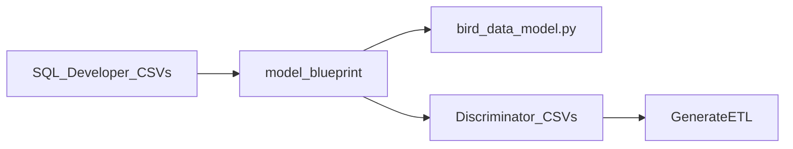

# Model blueprint

The SQL Developer import runs in two stages, with this package as the handover
between them.

## Stage 1 - build

`import_sqldev_ldm_to_blueprint.py` (and `import_sqldev_il_to_blueprint.py` for
the input layer) read the SQL Developer CSVs into the object graph defined in
`blueprint.py`. This is where the model's meaning is worked out:

- entities become `ModelClass`, attributes become `Field`, relations become
  `Relationship`,
- domains become `Enumeration` with coded `EnumerationValue` entries,
- **arcs** - SQL Developer's disjoint subtyping - become an abstract arc class,
  a `{arc}_delegate` relationship on the source class, and arc membership as a
  superclass on each target,
- SQL Developer facts that have no structural home (long names, identifying
  relationships, entity hierarchies, input-layer mappings) become annotations.

The build is deliberately forgiving: classes may be created before their
superclasses, relationships may point at classes that do not exist yet, and arcs
are resolved as the CSVs are walked.

## Stage 2 - emit

`emit_django_from_blueprint.py` writes the finished graph out as Django source,
ordering classes after their superclasses and turning enumerations into
`choices` dictionaries. `traverser.py` walks the same graph to produce the
discriminator CSVs that `GenerateETL` consumes.

## Why not build Django models directly

Blueprints *look like* Django but are plain Python objects. Creating real
`models.Model` subclasses mid-import would fight Django's app registry, unique
`related_name`s, and the "generate a file, then migrate" workflow - and the
graph is still incomplete while it is being built. Emitting source keeps the
incomplete state harmless.

## Annotations

Class-level LDM metadata (`entity_metadata`, `key_metadata`) is carried in the
shape defined by `specs/BIRD_LDM_ANNOTATIONS_SPEC.md`; the emitter only
canonicalizes and serializes it into `__bird_annotations__["ldm"]`. Blueprint
`Annotation` objects are for the import's own bookkeeping and are not written to
the generated model.
