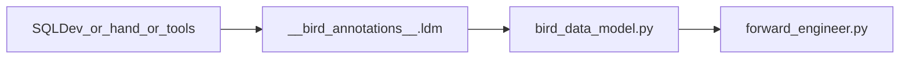

# Bird LDM Annotations Specification

## 1. Purpose and audience

This specification defines the canonical `__bird_annotations__` contract for Django LDM model classes in `birds_nest/pybirdai/models/bird_data_model.py`.

The annotations carry logical-model metadata that is not expressible (or not convenient) as ordinary Django fields, and that the forward-engineering (FE) pipeline consumes when folding LDM classes into input-layer style models.

**Audience**

| Audience | Role |
|----------|------|
| Human editors | Hand-edit annotations on classes without re-running SQL Developer import |
| Automated tools | Generate or patch annotations with a stable, documented schema |
| SQL Developer → Python importer | Emit this shape when generating `bird_data_model.py` |
| Forward engineering | Read only this contract when resolving PKs, FKs, domains, and subtype discriminators |

## 2. Goals and non-goals

### Goals

- Make annotations **clear, minimal, and editable** by people and tools—not only by the SQL Developer import path.
- Restrict the contract to keys that **forward engineering actually uses**.
- Use a purpose-named namespace (`ldm`) so the contract is not tied to a single authoring tool.
- Require FE to consume `__bird_annotations__["ldm"]`.

### Non-goals

- Changing the RegDNA / pyecore / XCore annotation model used during SQL Developer import.
- Requiring every Django class to have annotations (omit sections that do not apply).
- Encoding logical entity display names for FE policy matching inside annotations (FE continues to use `Meta.verbose_name` and the Python class name).
- Carrying SQL Developer export noise that FE does not read.

## 3. Data flow



All authoring sources (SQL Developer importer, hand edits, automated tools) must emit the same `ldm` shape. Forward engineering must not depend on importer-private keys.

## 4. Canonical schema

### 4.1 Placement

On each relevant Django model class:

```python
class EXAMPLE_ENTITY(models.Model):
    __bird_annotations__ = {
        "ldm": {
            # sections below
        }
    }
    # ... Django fields ...

    class Meta:
        verbose_name = "Example_entity"
        verbose_name_plural = "Example_entitys"
```

- Top-level key: `__bird_annotations__` (class attribute, not a Django field).
- Namespace key: **`ldm`** (required when annotations are present).
- The legacy key `sql_developer` is **not** part of the canonical contract (see [Migration](#9-migration-notes)).

### 4.2 Complete example

```python
__bird_annotations__ = {
    "ldm": {
        "primary_key": ["FIELD_A", "FIELD_B"],
        "primary_key_fields": [
            {"field": "FIELD_A", "sequence": 1},
            {"field": "FIELD_B", "sequence": 2},
        ],
        "foreign_keys": [
            {
                "relation_name": "Example_relates_to_parent",
                "identifying": True,
                "relation_side": "target",
                "source_class": "PARENT",
                "target_class": "EXAMPLE_ENTITY",
                "referenced_class": "PARENT",
                "source_entity": "Parent_entity",
                "referenced_entity": "Parent_entity",
                "fields": ["FIELD_A", "FIELD_B"],
                "field_entries": [
                    {"field": "FIELD_A", "sequence": 1, "primary_key": True},
                    {"field": "FIELD_B", "sequence": 2, "primary_key": True},
                ],
                "number_of_attributes": 2,
                "one_to_one": False,
                "source_optional": True,
            }
        ],
        "fields": {
            "SOME_FIELD": {
                "domain_synonym": "ACCNTNG_FRMWRK",
                "domain_field_name": "ACCNTNG_FRMWRK_domain",
                "domain_name": "Accounting framework",
                "domain_id": "E121E041-B09C-AB9A-70C9-78308EDD10E8",
                "primary_key": False,
                "foreign_key": False,
                "add_not_applicable_candidate": False,
                "hierarchy_sibling_missing_field": False,
            }
        },
        "entity_member": {
            "discriminator_field": "SOME_TYP",
            "domain_synonym": "SOME_TYP",
            "domain_name": "Some type",
            "member_code": "7",
            "member_label": "Example_subtype_label",
        },
        # Optional rare override:
        # "attribute_inheritance_type": "all attributes",
    }
}
```

### 4.3 Top-level `ldm` keys

| Key | Type | Required | Description |
|-----|------|----------|-------------|
| `primary_key` | `list[str]` | Recommended when the class has a composite or logical PK | Ordered list of primary-key field names |
| `primary_key_fields` | `list[object]` | Preferred when component order matters | Ordered PK entries with `field` and `sequence` |
| `foreign_keys` | `list[object]` | When the class participates in LDM relationships FE must resolve | Relationship / composite FK metadata |
| `fields` | `dict[str, object]` | When FE needs domain or N/A metadata for attributes | Per Django field-name metadata |
| `entity_member` | `object` | On subtype classes that map to a discriminator member | Subtype discriminator membership |
| `attribute_inheritance_type` | `str` | Rare | When set to `"all attributes"` (or `"all atributes"` legacy spelling), FE skips certain “not applicable” inheritance rules |

Omit any section that does not apply. Empty lists/dicts may be omitted.

### 4.4 `primary_key_fields[]` entries

| Key | Type | Required | Description |
|-----|------|----------|-------------|
| `field` | `str` | Yes | Django field name on this class |
| `sequence` | `int` | Yes | 1-based (or stable integer) order within the PK |

**Rule:** When order matters for mapping composite FK components to a referenced PK, FE prefers `primary_key_fields` (sorted by `sequence`). `primary_key` remains a convenience list of the same names.

### 4.5 `foreign_keys[]` entries

| Key | Type | Required | Description |
|-----|------|----------|-------------|
| `relation_name` | `str` | Yes | LDM relation name; used to match Django `ForeignKey` field names and special cases (e.g. Model_Context) |
| `identifying` | `bool` | Yes | Whether the relationship is identifying |
| `relation_side` | `"source"` \| `"target"` | Yes | Side of the relationship this class sits on |
| `source_class` | `str` | Recommended | Python class name of the relation source |
| `target_class` | `str` | Recommended | Python class name of the relation target |
| `referenced_class` | `str` | Recommended | Class this side references (often the other endpoint) |
| `source_entity` | `str` | When entity-name matching is needed | Logical source entity name |
| `referenced_entity` | `str` | When entity-name matching is needed | Logical referenced entity name |
| `fields` | `list[str]` | Yes | FK component field names on this class |
| `field_entries` | `list[object]` | Preferred when order or per-component PK flags matter | Ordered FK components |
| `number_of_attributes` | `int` | When FE checks “standard identifying” patterns | Count of attributes in the relation |
| `one_to_one` | `bool` | When optional 1:1 N/A rules apply | Whether the relation is one-to-one |
| `source_optional` | `bool` | When optional 1:1 N/A rules apply | Whether the source side is optional |

#### `field_entries[]` entries

| Key | Type | Required | Description |
|-----|------|----------|-------------|
| `field` | `str` | Yes | Component field name |
| `sequence` | `int` | Yes | Order within the FK |
| `primary_key` | `bool` | Recommended | Whether this component is part of the class PK |

**Normalization:** Prefer JSON booleans (`true`/`false` in the dict). During migration only, FE may temporarily accept `"Y"`/`"N"` for `identifying`, `one_to_one`, and `source_optional`.

### 4.6 `fields.<FIELD_NAME>` entries

Keys are Django field names on the class (or inherited attributes FE considers).

| Key | Type | Required | Description |
|-----|------|----------|-------------|
| `domain_synonym` | `str` | When domain logic applies | Short domain code (e.g. `ACCNTNG_FRMWRK`, `BLN_TF`) |
| `domain_field_name` | `str` | When choices attribute naming matters | Choices dict name (often `*_domain`) |
| `domain_name` | `str` | When matching by long domain name | Human / LDM domain name |
| `domain_id` | `str` | When special domain handling applies | Domain identifier (e.g. boolean domain `DOM3000004`) |
| `primary_key` | `bool` | Recommended for key attributes | Field is part of the primary key |
| `foreign_key` | `bool` | Recommended for FK attributes | Field is part of a foreign key |
| `add_not_applicable_candidate` | `bool` | When N/A injection should be forced | FE may add a “Not applicable” choice |
| `hierarchy_sibling_missing_field` | `bool` | When N/A injection should be forced | Sibling in hierarchy lacks this field |

At least one domain key (`domain_synonym`, `domain_field_name`, or `domain_name`) should be present when the field is enumerative / domain-driven.

### 4.7 `entity_member` object

Present on **subtype** classes that correspond to one member of a discriminator domain.

| Key | Type | Required | Description |
|-----|------|----------|-------------|
| `discriminator_field` | `str` | Yes (or provide `domain_synonym` / `domain_name`) | Django field that holds the discriminator |
| `domain_synonym` | `str` | Alternate discriminator identity | Domain synonym for the discriminator |
| `domain_name` | `str` | Alternate discriminator identity | Domain long name |
| `member_code` | `str` | Yes | Choice code for this subtype |
| `member_label` | `str` | Yes | Choice label for this subtype |

**Canonical keys only:** use `member_code` and `member_label`. Do not introduce `value`, `label`, `member_description`, or `source_member_description` in new annotations (legacy aliases may be read during migration only).

## 5. Semantics (what forward engineering uses each part for)

| Section | FE behaviour |
|---------|----------------|
| `primary_key` | Match FK field sets to the class PK; treat fields as key components |
| `primary_key_fields` | Ordered mapping of composite FK components onto referenced PK columns (`field` + `sequence`) |
| `foreign_keys` | Resolve identifying vs non-identifying joins; find related classes; order composite keys; optional 1:1 / source-optional N/A rules; match relation names to Django FKs |
| `fields` | Domain / role-type detection; boolean-domain special cases; PK/FK flags; “Not applicable” choice injection |
| `entity_member` | Reduce subtype hierarchies to discriminator choice values; match discriminator field to class |
| `attribute_inheritance_type` | If `"all attributes"`, skip certain N/A inheritance heuristics |

**Logical names:** FE policy matching for include/merge entity sets uses `Meta.verbose_name` and the Python class name—not annotation keys such as a former `entity_name`.

## 6. Editing guidance

### Minimal valid annotations

- A root entity with only a simple Django `primary_key=True` field may omit `__bird_annotations__` entirely if FE does not need composite keys, domains, or relationships from annotations.
- A subtype that only needs discriminator mapping may provide only `entity_member`.
- A relationship-heavy assignment entity typically needs `primary_key` / `primary_key_fields`, `foreign_keys`, and relevant `fields` entries.

### Consistency rules

1. Every name in `primary_key`, `primary_key_fields[].field`, `foreign_keys[].fields`, and `fields` keys should correspond to a real Django field on the class (declared or inherited), unless intentionally documenting a logical key component FE still resolves by name.
2. `foreign_keys[].relation_name` should align with the Django `ForeignKey` attribute name when one exists for that relationship.
3. `entity_member.discriminator_field` should name a field that exists on the class or a superclass and that owns the relevant choices.
4. Prefer booleans over string flags.
5. Prefer `primary_key_fields` whenever `sequence` matters; keep `primary_key` as the same ordered list of names for convenience.
6. Do not add excluded / non-contract keys (see below); tools may strip them.

### When to omit sections

| Situation | Omit |
|-----------|------|
| No composite / logical PK metadata needed | `primary_key`, `primary_key_fields` |
| No LDM relationships FE must resolve | `foreign_keys` |
| No domain or N/A metadata | `fields` |
| Not a discriminator subtype | `entity_member` |
| Default inheritance behaviour | `attribute_inheritance_type` |

## 7. Authoring sources

Any of the following may create or update `__bird_annotations__["ldm"]`:

1. **SQL Developer → Python importer** (`import_sqldev_ldm_to_django` / annotation enrichers) — must emit the `ldm` shape.
2. **Hand edits** in `bird_data_model.py` (or generated intermediates before copy).
3. **Automated tools** (AST patchers, linters, codegen) — must read/write the same schema.

All sources are peers with respect to the contract: FE must not assume annotations came from SQL Developer.

## 8. Forward-engineering requirement

Forward engineering **must** consume the new form:

```text
model_class.annotations["ldm"]
```

The contract lives in one module, `birds_nest/pybirdai/process_steps/forward_engineering/ldm_annotations.py`, which readers, writers, and linters all share:

| Accessor | Returns |
|----------|---------|
| `ldm_section(model_class)` | The `ldm` section, falling back to `sql_developer` while migrating |
| `primary_key(model_class)` | `primary_key` field names |
| `ordered_primary_key_fields(model_class)` | PK field names ordered by `sequence` |
| `foreign_keys(model_class)` | `foreign_keys` entries |
| `ordered_foreign_key_fields(foreign_key)` | FK component names ordered by `sequence` |
| `field_annotations(model_class, field_name)` | One `fields.<FIELD_NAME>` entry |
| `entity_member(model_class)` / `entity_member_code_and_label(member)` | Subtype discriminator membership |
| `flag(source, *keys)` / `is_identifying(foreign_key)` | Flags normalized to booleans |
| `ignores_attribute_inheritance(model_class)` | Whether `attribute_inheritance_type` opts out |

Writers use `canonical_annotations(annotations)`, linters use `validate_annotations(annotations, class_name)`, and tools that patch model source use `rewrite_annotations(source, transform)`.

`forward_engineer.py` reads annotations only through these accessors, so it no longer names a namespace itself. AST loading in `django_model_ast.py` is unchanged: it still parses `__bird_annotations__` into `ModelClass.annotations`.

FE must not require any key listed in [Excluded keys](#10-explicitly-excluded-non-contract).

## 9. Migration notes

`birds_nest/pybirdai/models/bird_data_model.py` has been migrated: all 600 annotated classes carry `ldm` only, and forward-engineering output is byte-identical to the pre-migration run.

1. **Dual-read window (in place):** accessors take `__bird_annotations__["ldm"]` when present and otherwise fall back to `__bird_annotations__["sql_developer"]`, so unmigrated models still forward-engineer.
2. **Writers emit `ldm` only:** both the SQL Developer importer (`import_sqldev_ldm_to_django.py`) and the annotation enricher (`ldm_annotation_enricher.py`) canonicalize before writing. The enricher still *reads* `relation_id` as a join key back to the SQL Developer CSVs, and falls back to matching on `relation_name` when annotations are already canonical; neither key survives into the written FK entry beyond `relation_name`.
3. **Legacy aliases (read-only during migration):**
   - `identifying` / `one_to_one` / `source_optional`: `"Y"`/`"N"` accepted
   - `entity_member.member_code`: legacy `value` accepted
   - `entity_member.member_label`: legacy `label`, `member_description`, `source_member_description` accepted
4. **Migrating a model file:**
   ```bash
   python -m pybirdai.process_steps.forward_engineering.migrate_ldm_annotations --model pybirdai/models/bird_data_model.py
   ```
   Add `--check` to lint without rewriting; it exits non-zero when the contract is violated.
5. **Remove** the dual-read and the legacy aliases once no unmigrated model file remains in circulation.
6. Do not document or regenerate excluded keys as part of the new contract.

## 10. Explicitly excluded (non-contract)

These keys appear in historical `sql_developer` annotations but are **out of contract**. Do not rely on them in FE; do not require them for hand/tool edits:

**Class-level**

- `entity_id`
- `entity_name`
- `classification_type`
- `engineering_strategy`
- `supertype_entity_id`
- `num_supertype_entity_id`

**Under `fields.*`**

- `attribute_id`
- `attribute_name`
- `field_name` (redundant with the dict key)
- `relation_id`
- `relation_name`
- `sequence`
- `not_applicable_present`

**Under `foreign_keys[]`**

- `relation_id`
- `source_id`
- `target_id`
- `target_entity`
- `target_optional`
- `source_to_target_cardinality`
- `target_to_source_cardinality`

**Under `primary_key_fields[]`**

- `foreign_key`
- `relation_id`
- `relation_name`

(Only `field` and `sequence` are in contract for PK field entries.)

## 11. Validation checklist

Tools that lint or generate annotations should verify:

- [ ] If `__bird_annotations__` is present, it contains `ldm` (after migration) and no required dependency on `sql_developer`.
- [ ] No excluded keys are required for FE correctness.
- [ ] Boolean fields use booleans in newly written data.
- [ ] `entity_member` uses `member_code` and `member_label` only.
- [ ] `primary_key` names match `primary_key_fields[].field` when both are present (same set and preferred order).
- [ ] Each `foreign_keys[].fields` entry appears in `field_entries` when `field_entries` is present.
- [ ] `relation_side` is only `"source"` or `"target"`.
- [ ] `fields` keys and FK/PK field names are consistent with Django field names where applicable.
- [ ] Subtype classes that FE should reduce via discriminators have a usable `entity_member` (discriminator identity + code + label).
- [ ] `Meta.verbose_name` remains the source of logical entity naming for FE policy, not annotation entity-name keys.

## 12. Related code (reference)

| Path | Role |
|------|------|
| `birds_nest/pybirdai/models/bird_data_model.py` | Annotated Django LDM classes |
| `birds_nest/pybirdai/process_steps/forward_engineering/ldm_annotations.py` | The contract: accessors, canonicalization, validation, source rewriting |
| `birds_nest/pybirdai/process_steps/forward_engineering/migrate_ldm_annotations.py` | Migration and lint CLI (`--check`) |
| `birds_nest/pybirdai/process_steps/forward_engineering/forward_engineer.py` | Consumer |
| `birds_nest/pybirdai/process_steps/forward_engineering/django_model_ast.py` | Parses `__bird_annotations__` |
| `birds_nest/pybirdai/process_steps/sqldeveloper_import/import_sqldev_ldm_to_django.py` | Writer, emits the canonical shape |
| `birds_nest/pybirdai/process_steps/sqldeveloper_import/ldm_annotation_enricher.py` | AST enricher, emits the canonical shape |
| `birds_nest/pybirdai/tests/test_forward_engineering.py` | Contract, migration, and FE regression tests |

## 13. Out of scope for this specification

- Changing RegDNA / XCore annotation models
- Changing which SQL Developer CSVs the importer reads
